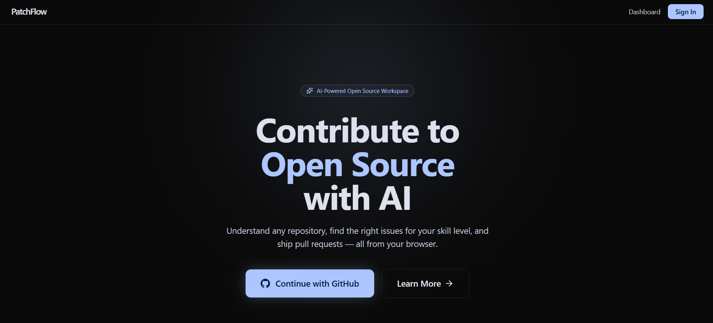
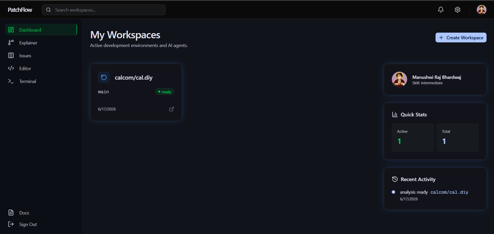
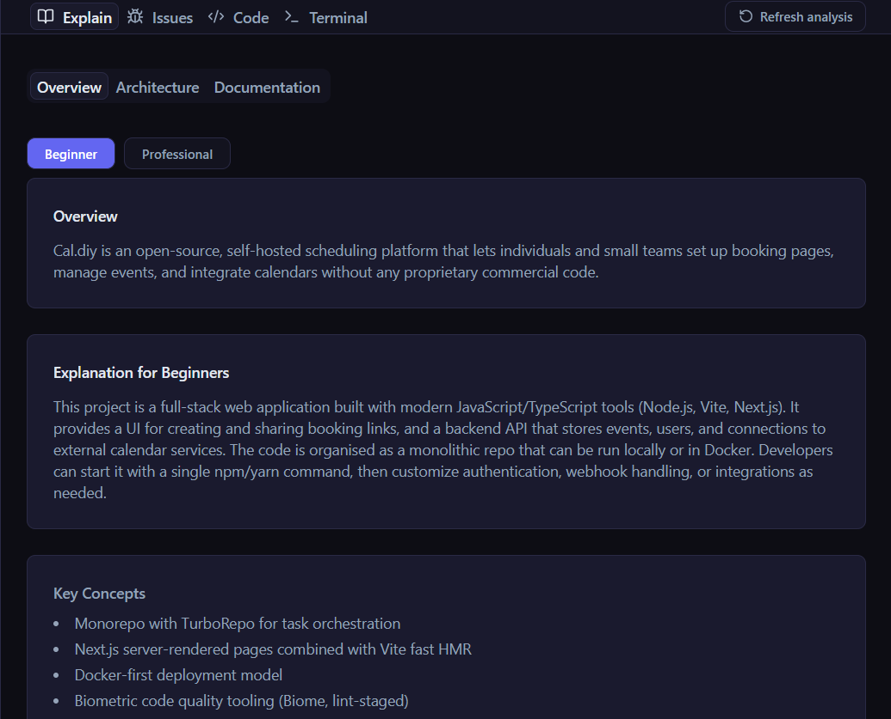
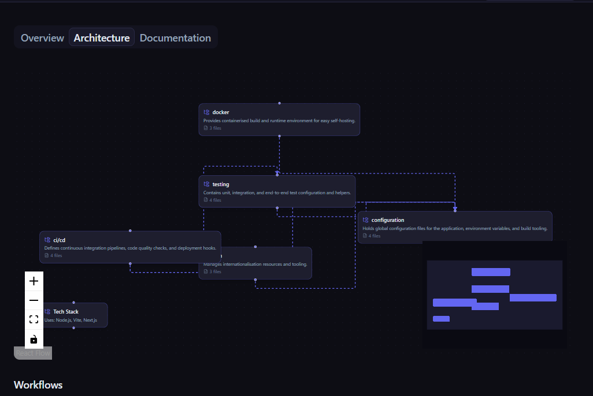

# PathFlow

AI-Powered Open Source Contribution Platform

Analyze any GitHub repository, classify issues by difficulty, and solve them with AI assistance — all from an in-browser IDE.

## Screenshots

| Landing Page | Dashboard |
|---|---|
|  |  |

| AI Explanation | Workflow Graph |
|---|---|
|  |  |

## Features

- **Repository Analysis** — Clone any public GitHub repo, parse its structure, detect tech stack
- **AI Documentation** — Auto-generate beginner-friendly and professional docs via OpenRouter
- **Architecture Graph** — Visual React Flow diagram of repo modules and dependencies
- **Issue Classification** — AI classifies issues by difficulty (beginner / intermediate / advanced)
- **In-browser IDE** — Monaco editor, file tree, AI chat assistant, Git panel, terminal
- **AI Issue Solving** — AI suggests fixes and can create pull requests directly
- **Skill-based Matching** — Detects user skill level and suggests matching issues

## Tech Stack

| Layer | Technology |
|---|---|
| **Frontend** | Next.js 16, React 19, TypeScript, Tailwind CSS 4, shadcn/ui, Monaco Editor, React Flow |
| **Backend** | FastAPI, SQLAlchemy, Alembic, Pydantic, GitPython, PyGithub |
| **Workers** | Celery, Redis |
| **AI** | OpenRouter (gpt-oss-120b), text-embedding-3-small |
| **Vector DB** | Qdrant |
| **Database** | PostgreSQL |
| **Infrastructure** | Docker Compose, Railway, Nixpacks |

## Architecture

```
┌─────────────┐     ┌──────────────┐     ┌──────────────┐
│   Frontend  │────▶│   Backend    │────▶│    Worker    │
│  Next.js 16 │     │   FastAPI    │     │   Celery     │
│  :3000      │◀────│   :8000      │◀────│   (async)    │
└─────────────┘     └──────┬───────┘     └──────┬───────┘
                           │                     │
                    ┌──────┴───────┐     ┌───────┴──────┐
                    │  PostgreSQL  │     │    Redis     │
                    │   (Neon)     │     │  (Upstash)   │
                    └──────────────┘     └──────────────┘
                           │                     │
                    ┌──────┴───────┐             │
                    │   Qdrant     │◀────────────┘
                    │  (Vector DB) │
                    └──────────────┘
```

**Analysis Pipeline:** `clone → parse → (embed + docs in parallel) → graph → classify_issues`

## Project Structure

```
patchflow/
├── assets/                    # Screenshots for README
├── backend/                   # FastAPI backend service
│   ├── alembic/               # Database migrations
│   └── app/
│       ├── core/              # Config, database, security, deps
│       ├── models/            # SQLAlchemy models (User, Workspace, Issue)
│       ├── routers/           # API routes (auth, workspace, issues, ai, git, files, terminal)
│       ├── schemas/           # Pydantic request/response schemas
│       └── services/          # Business logic (AI, GitHub, cache, vector, rate_limiter)
├── frontend/                  # Next.js frontend
│   └── src/
│       ├── app/               # Pages (landing, auth, dashboard, workspace)
│       ├── components/        # React components (IDE, issues, repo, layout, UI)
│       ├── hooks/             # Custom React hooks (useAIStream, useAuth)
│       └── lib/               # Utilities (API client, helpers)
├── shared/                    # Shared code between backend and worker
│   ├── constants.py           # Paths, chunk sizes, cache TTLs
│   ├── prompts.py             # AI system prompts
│   └── types.py               # Enums (WorkspaceStatus, SkillLevel, IssueDifficulty)
├── worker/                    # Celery worker service
│   └── tasks/                 # Async tasks (clone, parse, embed, docs, graph, issues)
├── docker-compose.yml         # Local infrastructure (PostgreSQL, Redis, Qdrant)
├── Makefile                   # Dev command shortcuts
├── .env.example               # Environment variable template
├── main.py                    # Entry point (runs migrations, starts backend)
└── requirements.txt           # Root Python dependencies
```

## Getting Started

### Prerequisites

- Python 3.12+
- Node.js 20+
- Docker (for local PostgreSQL, Redis, Qdrant)
- A [GitHub OAuth App](https://github.com/settings/developers)
- Free accounts: [Neon](https://neon.tech) (PostgreSQL), [Upstash](https://upstash.com) (Redis), [Qdrant Cloud](https://qdrant.tech), [OpenRouter](https://openrouter.ai)


### Manual Setup

**Backend:**
```bash
cd backend
pip install -r requirements.txt
alembic upgrade head
uvicorn main:app --reload --port 8000
```

**Worker:**
```bash
cd worker
pip install -r requirements.txt
celery -A celery_app worker --loglevel=info --pool=solo
```

**Frontend:**
```bash
cd frontend
npm install
npm run dev
```

### Docker Compose (infrastructure only)

```bash
docker-compose up -d
```

Starts PostgreSQL (:5432), Redis (:6379), and Qdrant (:6333).


## Environment Variables

| Variable | Description |
|---|---|
| `GITHUB_CLIENT_ID` | GitHub OAuth App client ID |
| `GITHUB_CLIENT_SECRET` | GitHub OAuth App client secret |
| `GITHUB_REDIRECT_URI` | OAuth callback URL |
| `DATABASE_URL` | PostgreSQL connection string |
| `REDIS_URL` / `UPSTASH_REDIS_REST_URL` | Redis connection |
| `QDRANT_URL` / `QDRANT_API_KEY` | Qdrant vector database credentials |
| `OPENROUTER_API_KEY` | OpenRouter API key for AI models |
| `SECRET_KEY` | Secret for session token signing |
| `FRONTEND_URL` / `BACKEND_URL` | Service URLs |

## Deployment

The project is configured for deployment on [Railway](https://railway.app):

- `backend/railway.json` — Backend service config
- `worker/railway.json` — Worker service config
- `nixpacks.toml` — Build configuration
- `Procfile` — Process definitions
