# PatchFlow 🚀

AI-powered open-source contribution platform. PatchFlow helps developers understand codebases, explore issues matched to their skill levels, run terminals, and ship contributions with the help of integrated AI Agents — all from their browser.

---

## Table of Contents
1. [About PatchFlow](#about-patchflow)
2. [Tech Stack](#tech-stack)
3. [Key Features & Screenshots](#key-features--screenshots)
4. [File & Folder Structure](#file--folder-structure)
5. [Setup & Installation](#setup--installation)
6. [How to Run the Project](#how-to-run-the-project)

---

## About PatchFlow
PatchFlow is designed to bridge the gap between developers and open-source contributions. When a repository is linked:
1. It is cloned and parsed to create an abstract file graph.
2. Code components are embedded and vectorized for semantic search.
3. An AI agent compiles a structured codebase explanation (for both beginners and professionals).
4. Code diagrams and interactive Kanban boards map GitHub issues to developers based on their skill profile.
5. In-browser IDEs, terminals, and Git controls let users write and submit PRs seamlessly.

---

## Tech Stack
* **Frontend**: Next.js 16, TypeScript, Tailwind CSS, Shadcn/ui, Monaco Editor, React Flow
* **Backend API**: FastAPI, SQLAlchemy, Alembic, GitPython
* **Asynchronous Workers**: Celery, Redis
* **AI & Embeddings**: OpenRouter (GPT-4o Mini / Text Embedding 3)
* **Vector Database**: Qdrant Cloud
* **Relational Database**: PostgreSQL (Neon Serverless)

---

## Key Features & Screenshots

### 1. Landing & Authentication
Get started by authenticating securely with GitHub OAuth.
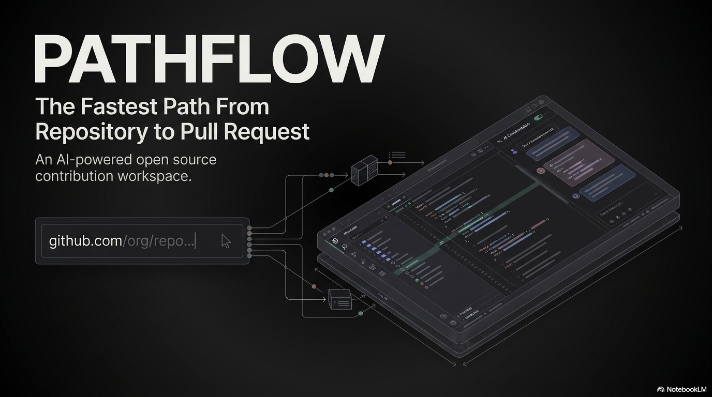

### 2. Workspaces Dashboard
Manage all active repositories, track stats (active vs. total workspaces), and monitor recent platform activities.
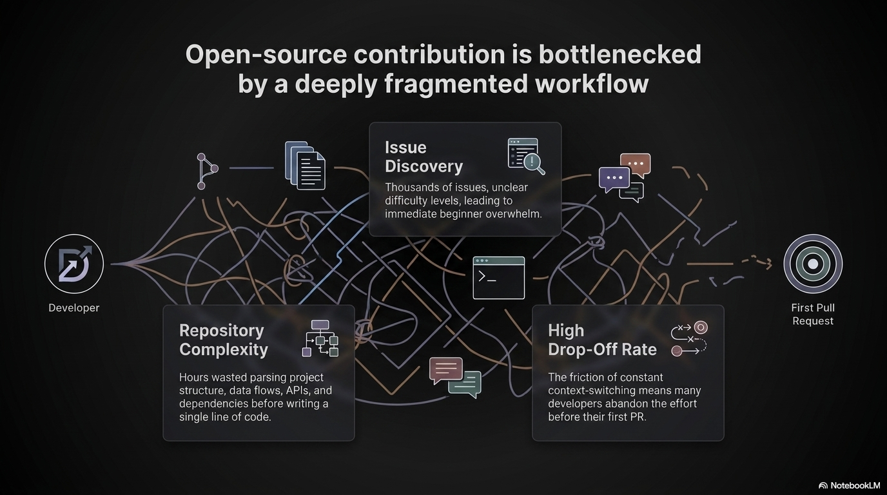

### 3. Create a New Workspace
Initiate a repository analysis simply by pasting its GitHub URL.
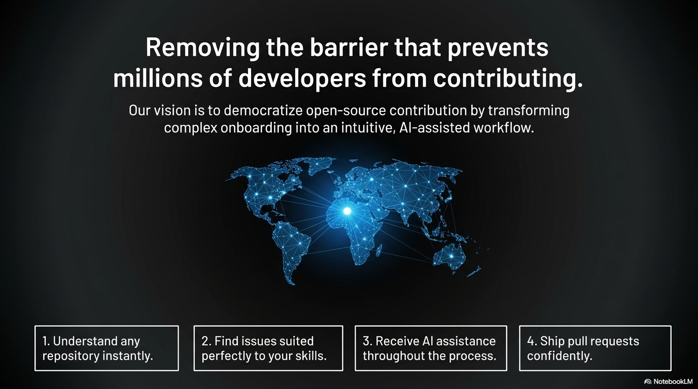

### 4. Background Repository Analysis
Celery workers run background tasks to clone, parse files, create embeddings, compile documentation, and map architecture flows.
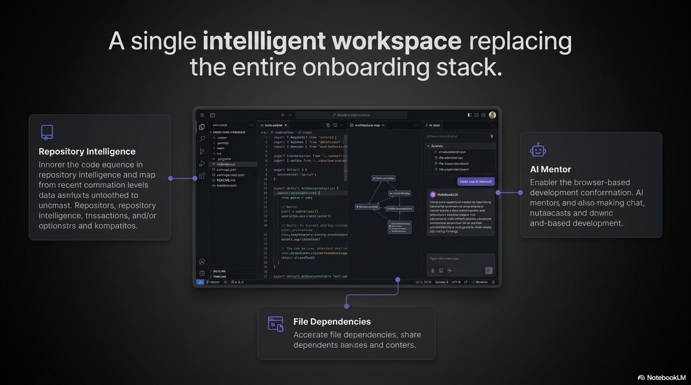

### 5. AI Code Explainer (Beginners)
Interactive walkthroughs explaining key concepts and overall repository structure in plain language.
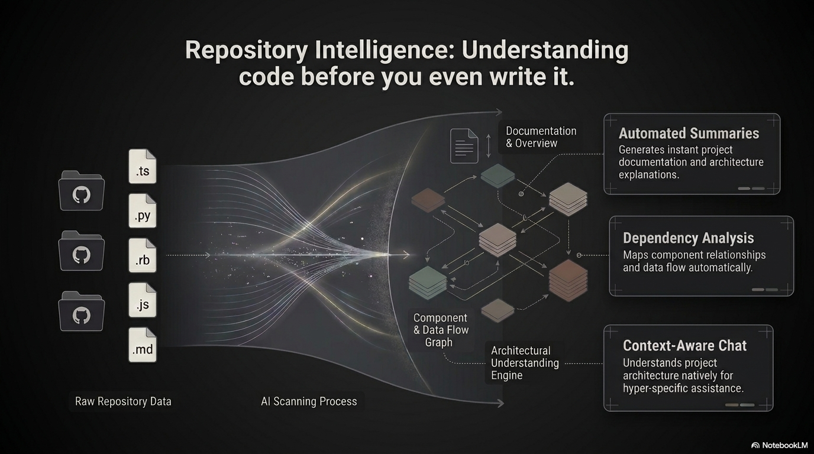

### 6. AI Code Explainer (Professionals)
Provides frameworks, language summaries, detected tech stacks, and modular descriptions.
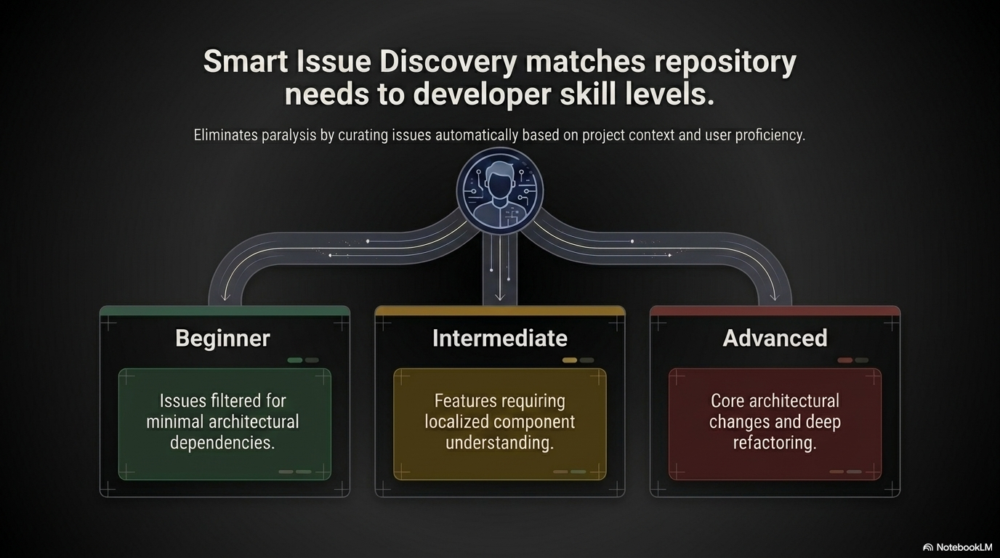

### 7. Interactive Architecture Diagram
Visualizes dependencies and import connections in a node-based architecture graph.
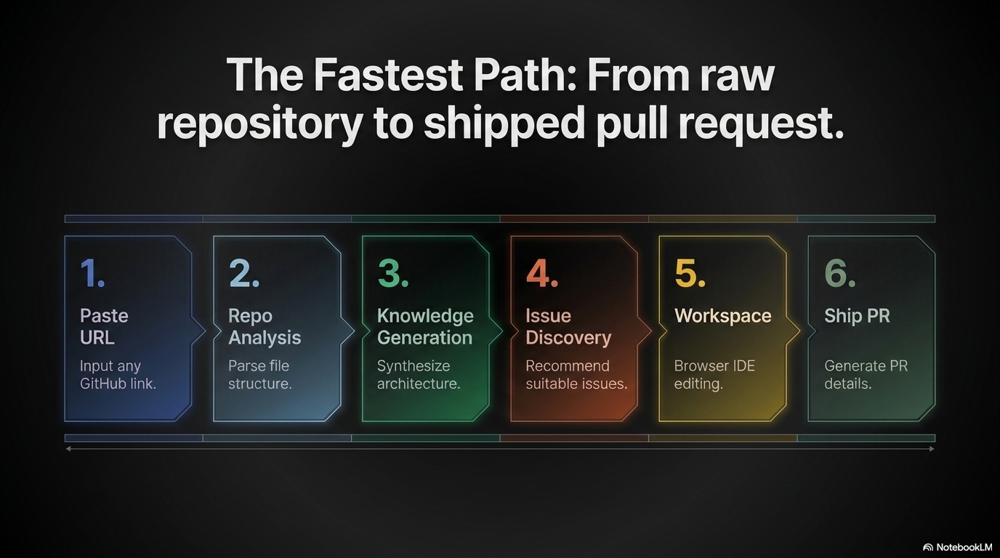

### 8. System & API Documentation
Generates structural documentation including Database diagrams, API Architecture routes, and deployment flows.
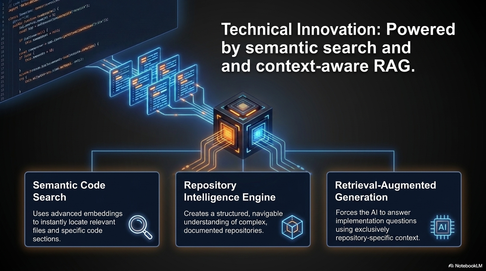

### 9. Issues Kanban Board
Categorizes GitHub issues by difficulty level (Beginner, Intermediate, Advanced) and status.
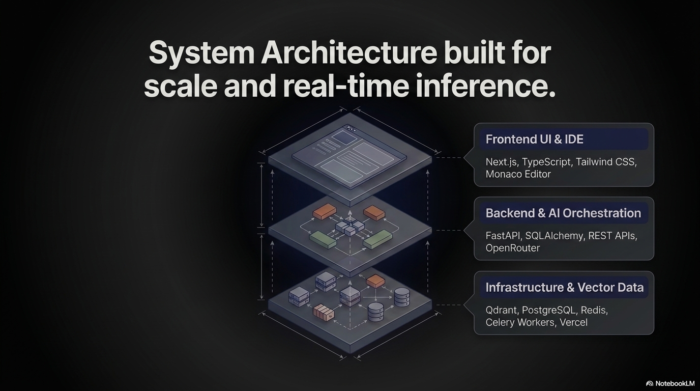

### 10. Web-based IDE Editor
Monaco-powered code editor with syntax highlighting and full workspace folder explorer.
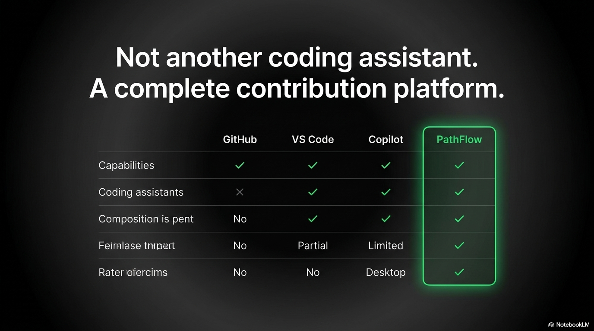

### 11. Simulated Workspace Terminal
Run shell commands directly in the context of the workspace clone.
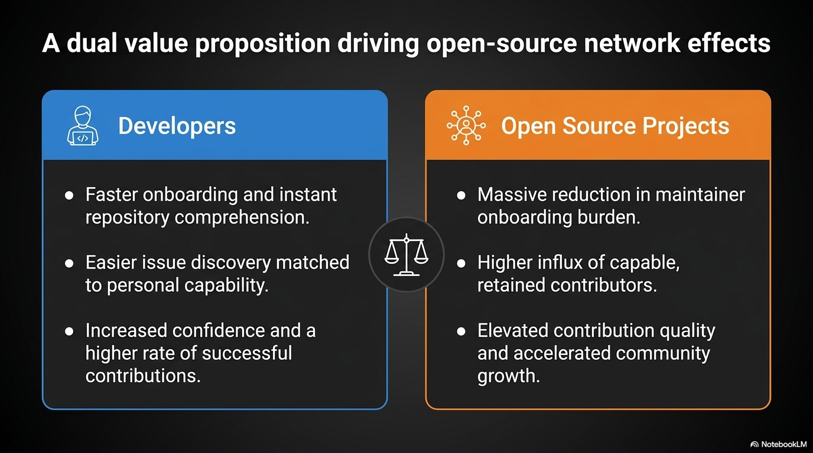

### 12. AI Assistant Chat & Git Controls
Context-aware AI chat helps write fixes while Git panel manages staging, committing, branching, and pull requests.
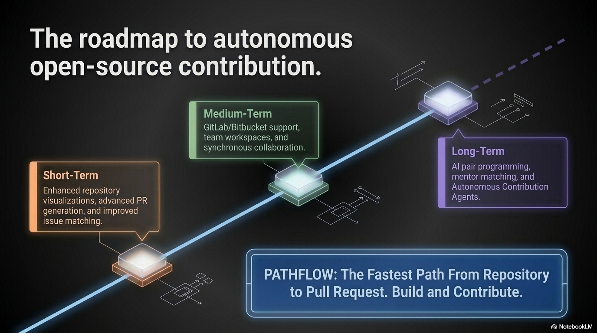

---

## File & Folder Structure

```
patchflow/
├── backend/                  # FastAPI Application
│   ├── alembic/              # Database migration schemas
│   ├── app/                  # Application core code
│   │   ├── core/             # Configuration & connection clients
│   │   ├── models/           # SQLAlchemy DB models (user, workspace, issue)
│   │   ├── routers/          # Route controller endpoints (auth, git, terminal)
│   │   ├── schemas/          # Pydantic data schemas
│   │   └── services/         # Core business logic (ai, cache, github, vector)
│   ├── main.py               # Backend webserver entry point
│   └── requirements.txt      # Python dependencies
├── worker/                   # Celery Async Processing Client
│   ├── tasks/                # Repository analysis tasks (clone, embed, docs)
│   ├── celery_app.py         # Celery instance initialisation
│   ├── celeryconfig.py       # Task routes & path settings
│   └── db_utils.py           # Background sync DB connection utilities
├── shared/                   # Shared modules
│   ├── constants.py          # Shared constants
│   ├── prompts.py            # LLM prompts templates
│   └── types.py              # Common type interfaces
├── frontend/                 # Next.js 16 Web UI
│   ├── src/
│   │   ├── app/              # Router page routes (dashboard, workspace)
│   │   ├── components/       # Interface views (Monaco IDE, Kanban, terminal)
│   │   ├── hooks/            # Auth and system React hooks
│   │   └── lib/              # Client side API utils
│   └── package.json          # Frontend packages
├── docs/
│   └── screenshots/          # Extracted slide image assets
├── Makefile                  # Local automation scripts
└── README.md                 # Documentation
```

---

## Setup & Installation

### 1. Clone the repository
```bash
git clone <your-repository-url>
cd patchflow
```

### 2. Configure Environment Variables
Copy `.env.example` to create a `.env` file and enter your credentials:
```bash
cp .env.example .env
```
Fill out the variables:
* **GitHub OAuth**: Client ID, Secret, and Redirect URI.
* **Databases**: Neon PostgreSQL Connection string (`DATABASE_URL`).
* **Cache**: Redis Connection string (`REDIS_URL`).
* **Embeddings**: OpenRouter API key and model names.
* **Vector Store**: Qdrant Cloud URL and API Key.

---

## How to Run the Project

Ensure you have a Python virtual environment activated.

### 1. Setup Virtual Environment
Run from the `patchflow` folder:
* **Windows**:
  ```bash
  python -m venv .venv
  source .venv/Scripts/activate
  ```
* **macOS/Linux**:
  ```bash
  python -m venv .venv
  source .venv/bin/activate
  ```

### 2. Install Dependencies
```bash
# Frontend
cd frontend && npm install && cd ..

# Backend & Worker
cd backend && pip install -r requirements.txt && cd ..
```

### 3. Run Migrations
```bash
cd backend
alembic upgrade head
cd ..
```

### 4. Start Services (In separate terminal windows)

* **FastAPI Backend API** (Terminal 1):
  ```bash
  cd backend
  source ../.venv/Scripts/activate # Windows
  uvicorn main:app --reload --port 8000
  ```
* **Celery Worker** (Terminal 2):
  ```bash
  cd worker
  source ../.venv/Scripts/activate # Windows
  # --pool=solo is required on Windows
  celery -A celery_app worker --loglevel=info --pool=solo
  ```
* **Next.js Frontend** (Terminal 3):
  ```bash
  cd frontend
  npm run dev
  ```
*(Alternatively, if `make` is installed on your system, you can start all at once by running `make dev`.)*

Access the application at [http://localhost:3000](http://localhost:3000).
